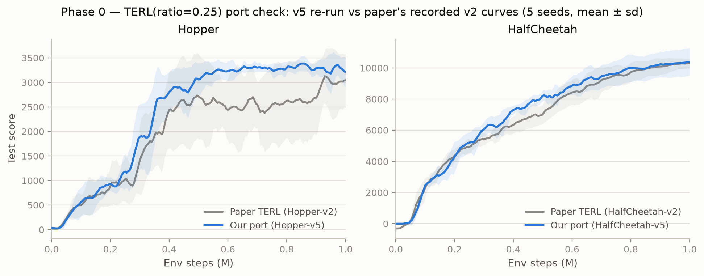
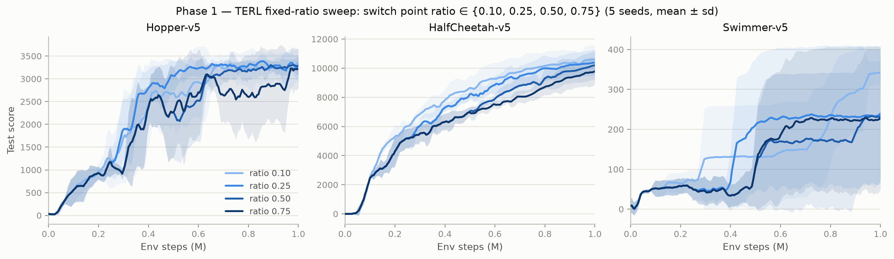
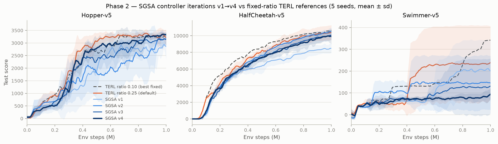
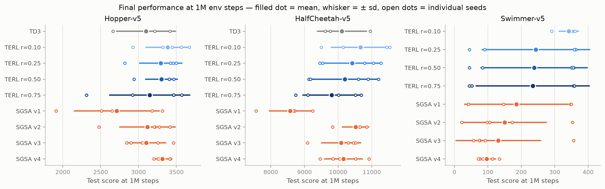
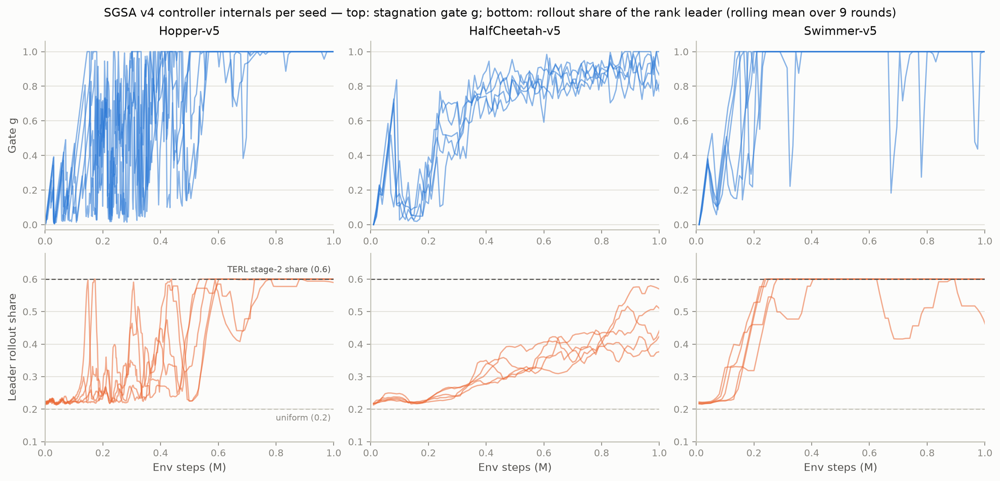

# Adaptive-TERL 扫描实验总结（截至 2026-08-01）

本文档汇总 `runs_v2/` 下已完成的全部扫描实验：**128 个 run 全部带 `DONE` 标记**，即 Phase 0（移植校验）、Phase 1（固定 ratio 敏感性扫描）与 Phase 2 目前四轮 SGSA 控制器迭代（v1→v4）的结果。所有曲线与表格均由 `metrics.jsonl` 聚合而来（W&B 项目上有同样的在线记录）。

**实验矩阵**：3 个环境（Hopper-v5、HalfCheetah-v5、Swimmer-v5）× 1M 环境步；每组 5 个种子。各组：TERL 固定 ratio ∈ {0.10, 0.25, 0.50, 0.75}、SGSA v1–v4；另有 TD3 基线（仅 Hopper/HalfCheetah，各 3 种子）与 Hopper 上的 `aterl-fixedchk` 回归检验组（2 种子）。所有方法保持 UTD=1（每环境步 1 次梯度更新），任何个体产生的转移都计入步数预算——**各方法计算量严格公平**。

**图表口径**：学习曲线取 `test_score`，按 5k 步网格做前值保持（LOCF），再做窗口 5（≈25k 步）滑动平均；实线为 5 种子均值，阴影为 ±1 标准差。表格数值为 1M（或 0.5M）步处最后一次评估的种子均值 ± 标准差，与 `scripts/analyze_phase1.py` 输出一致。

---

## 1. Phase 0 — gymnasium/v5 移植校验

把我们移植后的 TERL（ratio=0.25）在 v5 环境上的曲线，与论文仓库 `TERL-main/learning_curves/` 记录的 v2 原始曲线对比（各 5 种子）：



| 环境                              | 250k | 500k | 1M              |
| --------------------------------- | ---- | ---- | --------------- |
| 论文 TERL（Hopper-v2）            | 1093 | 2697 | 3065            |
| 我们的 TERL（Hopper-v5）          | 1191 | 3088 | **3294**  |
| 我们的 TD3（Hopper-v5，n=3）      | 996  | 1578 | 3099            |
| 论文 TERL（HalfCheetah-v2）       | 5094 | 7172 | 10412           |
| 我们的 TERL（HalfCheetah-v5）     | 5298 | 8228 | **10420** |
| 我们的 TD3（HalfCheetah-v5，n=3） | 7276 | 8714 | 10111           |

**结论：移植通过。** 1M 处两个环境均与论文记录持平或略优（HalfCheetah 10420 vs 10412；Hopper 3294 vs 3065），曲线形状一致，Phase-0 出口判据满足。

**重构回归检验**：`aterl-fixedchk`（用 aterl 代码路径 + `FixedStageController` 复现固定两阶段调度，Hopper 2 种子）1M 得分 3123 / 3203，落在 `terl` 组五个种子的范围（2818–3499）之内——控制器接口重构没有引入行为偏差。

---

## 2. Phase 1 — 固定 ratio 敏感性扫描（论文 Figure 1 的动机实验）

TERL 的核心超参数是探索→利用的切换点 `ratio`（原文硬编码 0.25）。扫描 ratio ∈ {0.10, 0.25, 0.50, 0.75} × 3 环境 × 5 种子：



1M 步最终得分（均值 ± 标准差，n=5）：

| ratio        | Hopper-v5             | HalfCheetah-v5         | Swimmer-v5          |
| ------------ | --------------------- | ---------------------- | ------------------- |
| 0.10         | **3388 ± 289** | **10661 ± 864** | **342 ± 29** |
| 0.25（默认） | 3294 ± 280           | 10420 ± 859           | 244 ± 161          |
| 0.50         | 3304 ± 211           | 10201 ± 976           | 238 ± 159          |
| 0.75         | 3148 ± 531           | 9810 ± 858            | 234 ± 170          |

主要发现：

1. **默认 0.25 并非最优**：三个环境的最优固定 ratio 都是 0.10，README 中"HalfCheetah 偏好更小 ratio"的说法在 v5 上成立，且不止 HalfCheetah。
2. **ratio 影响随环境放大，Swimmer 呈双峰**：ratio ≥ 0.25 时各有 2/5 种子卡在 ~45–90 的失败步态（因此 σ≈160），而 ratio=0.10 五个种子全部达到 ~290–360（σ=29）。切换点的选取在 Swimmer 上决定成败——这正是自适应控制器的动机。
3. **确定性副产品**：0.5M 处 r=0.50 与 r=0.75 两组数字完全相同（Hopper 均 2354±994，HalfCheetah 均 7024±330），因为切换发生前两者调度一致、同种子轨迹逐位相同——顺带验证了运行的确定性。

---

## 3. Phase 2 — SGSA 控制器迭代（v1 → v4）

各版本的改动（对应提交历史，每项修复均可独立开关，留作消融组）：

| 版本 | 运行目录     | 关键改动                                                                                                                                                                                              |
| ---- | ------------ | ----------------------------------------------------------------------------------------------------------------------------------------------------------------------------------------------------- |
| v1   | `aterl`    | 初版 SGSA：停滞门控 g → softmax 温度分配、Δ 排名项、多样性下限、自适应 PSO 间隔                                                                                                                     |
| v2   | `aterl-v2` | 修 v1 三个失效模式：`improve_decay` 棘轮门（抗锯齿）、`prog_gate` 边际收益门、`alpha_anneal`（g→1 时坍缩到最优个体）；随后另修信号病理（首个有限 fitness 的 NaN 门、累积改进量、窗口均值统计） |
| v3   | `aterl-v3` | `rollout_floor=0.1`（g=1 时精确复现 TERL 阶段 2 的 6/10–1/10 分配）、最大余额法确定性分配、TERL 冠军确认协议；移除 challenger-overwrite                                                            |
| v4   | `aterl-v4` | 集中域（g>0.5）swap-overwrite：挑战者把 actor 捐入 best 槽（保持 critic/优化器连续性、零迁移），两槽交换 fitness 历史                                                                                 |





1M 步最终得分（均值 ± 标准差，n=5；括号内为参照）：

| 方法              | Hopper-v5            | HalfCheetah-v5         | Swimmer-v5 |
| ----------------- | -------------------- | ---------------------- | ---------- |
| SGSA v1           | 2713 ± 563          | 8576 ± 617            | 186 ± 155 |
| SGSA v2           | 3119 ± 368          | **10517 ± 391** | 150 ± 125 |
| SGSA v3           | 3104 ± 257          | 10089 ± 583           | 131 ± 127 |
| SGSA v4           | **3317 ± 98** | 10160 ± 567           | 96 ± 27   |
| （TERL 0.25）     | 3294 ± 280          | 10420 ± 859           | 244 ± 161 |
| （最优固定 0.10） | 3388 ± 289          | 10661 ± 864           | 342 ± 29  |

分环境结论：

- **Hopper：v4 达标，且是全场方差最小的一组。** v1→v4 单调改进（2713→3317）；v4 均值超过 TERL(0.25)，与最优固定 ratio 的置信区间重叠，σ=98 远小于任何固定 ratio 组（最优固定组 σ=289）。图 4 中 Hopper 的门 g 从低位逐步上升、~0.6M 后收敛——自适应调度按设计工作。
- **HalfCheetah：v2 仍是 SGSA 内最佳（10517±391）。** v3 的 best 槽频繁迁移导致回归（10089），v4 只部分恢复（10160）。v4 与 TERL(0.25) 差距 260 分、在种子噪声之内，与 r=0.10 的 CI 也重叠，但 v2>v4 说明 v3/v4 引入的改动在此环境有净损失——值得用各修复的独立开关做逐项消融。
- **Swimmer：未解决，且逐版恶化（186→150→131→96）。** v4 没有任何种子超过 135；能到 ~350 步态的种子数：v1 2/5、v2 1/5、v3 1/5、v4 0/5（固定 r=0.10 为 5/5）。

**Swimmer 失败机制（图 4）**：Swimmer 早期长时间停在 ~40–70 的平台，停滞门 g 在 ~0.15–0.25M 就饱和到 1，rollout 集中到 0.6 上限、梯度全部集中到 leader——之后再未退出集中域。但注意固定 r=0.10 同样在 100k 就全面集中，却 5/5 种子成功：说明问题不在"集中得早"，而在 **g=1 域与 TERL 阶段 2 之间仍存的语义差距**（v4 提交里已记录的已知差异：swap 触发用窗口均值领先而非 TERL 的历史纪录判据），以及饱和后多样性下限从未把 g 拉回。这是下一轮迭代的头号诊断对象。



（图 4 说明：Hopper 回合短、评估轮次密（每种子 ~430–500 轮），g 轨迹显得更振荡；HalfCheetah/Swimmer 每种子约 100 轮。下行为 leader 的 rollout 份额，0.6 虚线 = TERL 阶段 2 的 best 份额上限，0.2 = 均匀分配。）

---

## 4. gate 的现状

Gate 判据：**单一超参设置**在 ≥4/5 开发环境上 ≥ TERL(0.25)，且在 3 个扫描环境上与各自最优固定 ratio 的 CI 重叠。以 v4 为当前冠军：

| 环境           | ≥ TERL(0.25)？                    | 与最优固定 ratio CI 重叠？ |
| -------------- | ---------------------------------- | -------------------------- |
| Hopper-v5      | ✅（3317 vs 3294）                 | ✅                         |
| HalfCheetah-v5 | ≈（10160 vs 10420，差距在噪声内） | ✅（勉强）                 |
| Swimmer-v5     | ❌（96 vs 244）                    | ❌                         |

建议的下一步（按优先级）：

1. **Swimmer 诊断**：逐轮对比 v4 在 g=1 时的实际行为与 r=0.10 阶段 2（PSO 间隔、swap/champion 判据、多样性下限是否触发过——`controller/*` 日志已具备全部所需信号）。
2. **HalfCheetah 逐项消融**：v2→v3→v4 的每项改动均有独立开关，定位 v2→v4 净损失来源。
3. Hopper 结果（均值持平最优固定 + 方差最低）已是论文可用的正面证据，保留 v4 协议不动。

---

## 附录

**0.5M 中间得分**（均值 ± 标准差，n=5）：

| 方法        | Hopper-v5    | HalfCheetah-v5 | Swimmer-v5 |
| ----------- | ------------ | -------------- | ---------- |
| TERL r=0.10 | 2694 ± 695  | 8706 ± 984    | 132 ± 129 |
| TERL r=0.25 | 3088 ± 315  | 8228 ± 395    | 213 ± 165 |
| TERL r=0.50 | 2354 ± 994  | 7024 ± 330    | 129 ± 128 |
| TERL r=0.75 | 2354 ± 994  | 7024 ± 330    | 129 ± 128 |
| SGSA v1     | 1786 ± 1014 | 6339 ± 1105   | 54 ± 18   |
| SGSA v2     | 1736 ± 1128 | 7688 ± 371    | 147 ± 125 |
| SGSA v3     | 2359 ± 315  | 7305 ± 631    | 67 ± 9    |
| SGSA v4     | 2798 ± 377  | 7428 ± 611    | 65 ± 14   |

**复现**：

```bash
conda run -n asterl python scripts/analyze_phase1.py    # 本文各表的数字来源
conda run -n asterl python scripts/compare_phase0.py    # Phase-0 对照表
# 单个 run（同目录重跑 = 从 checkpoint 续跑；--fresh 重来）
conda run -n asterl python train.py --algo aterl --env Hopper-v5 --seed 0
```

图片生成脚本位于会话 scratchpad（读取 `runs_v2/*/*/seed*/metrics.jsonl` 与 `TERL-main/learning_curves/` 的 tfevents），输出至 `reports/figures/`。
